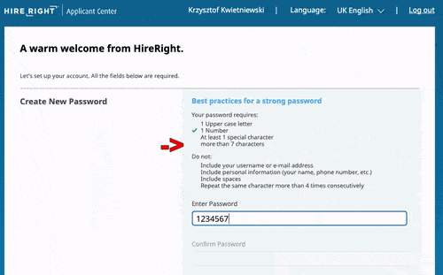

# [New Account] Passwords containing %

### HireRight uses weird regex for checking password length *isValidLength()*


### Regex:

```

/^[^%\s]{8,}/

```


Demo website:

---

https://smuger.github.io/HireRightPassword-Problem/

---




#### Which means that

| Accept      | Deny        |
| ----------- | ----------- |
| 12345678    | %2345678    |
| qwertyui    | 123%5678    |


---


### Code

```javascript
function isValidLength(input) {
	var reg = /^[^%\s]{8,}/;
    return reg.test(input);
}
```

---
### Solution

Change regex to /^[^\s]{8,}/
or
Add a note that you cannot use %